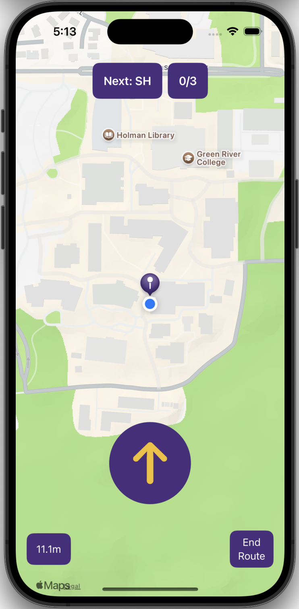
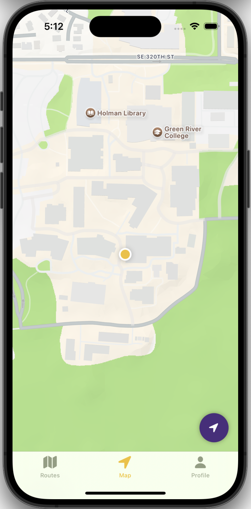
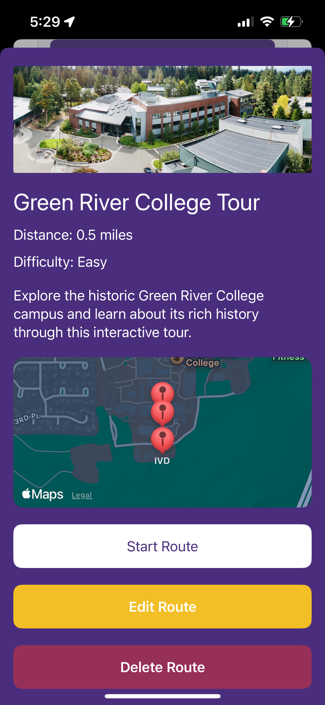
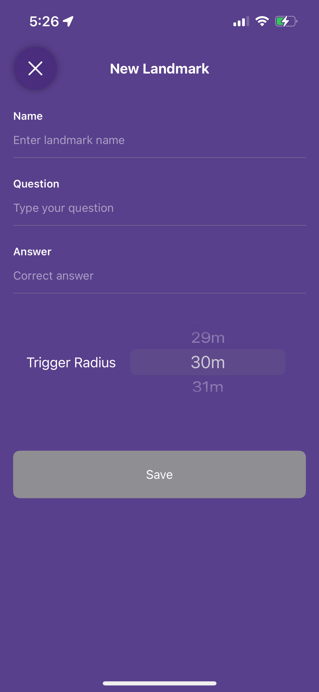
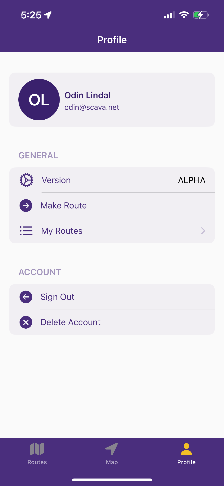
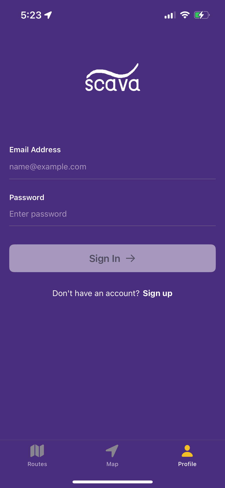
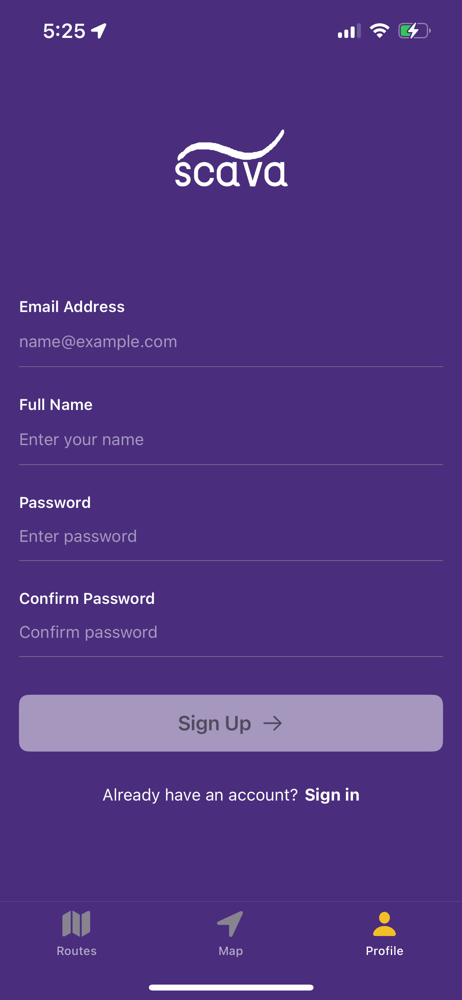
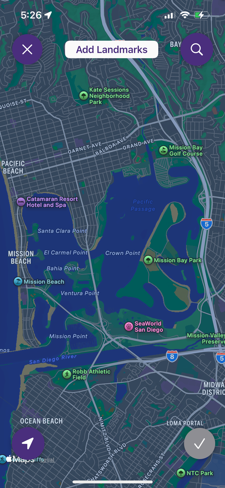

# Scava 🗺️

**Scava** is a location-based scavenger hunt iOS app built with SwiftUI that transforms any area into an interactive adventure. Users can discover landmarks, answer questions, and create their own custom routes to share with the community.

## ✨ Features

### 🎯 Core Gameplay
- **Location-Based Triggers**: Automatic question prompts when users enter landmark areas
- **Interactive Questions**: Answer questions to unlock the next checkpoint
- **Smart Route Optimization**: Landmarks are automatically ordered to minimize backtracking
- **Progress Tracking**: Save and resume routes across app sessions
- **Real-Time Navigation**: Directional arrows guide you to the next landmark

### 🗺️ Route Management
- **Browse Community Routes**: Discover scavenger hunts created by other users
- **Create Custom Routes**: Build your own adventures with the intuitive map builder
- **Route Metadata**: Set difficulty, estimated time, and descriptions
- **Rating System**: Rate routes and see community ratings
- **Personal Routes**: Manage your created routes in your profile

### 👤 User Experience
- **Firebase Authentication**: Secure user accounts with email/password
- **Offline Support**: Routes cached locally for offline play
- **Modern UI**: Clean, intuitive interface with custom theming
- **Haptic Feedback**: Enhanced user experience with tactile responses
- **Completion Tracking**: Track your completion times and progress

## 🛠️ Technology Stack

- **Frontend**: SwiftUI, iOS 15+
- **Backend**: Firebase (Firestore, Authentication)
- **Location Services**: Core Location, MapKit
- **Architecture**: MVVM with ObservableObject
- **State Management**: SwiftUI @Published properties
- **Data Persistence**: UserDefaults for local caching

## 📱 Screenshots

### Main Routes Browser


### Map View with Active Route


### Question Interface


### Route Creation Flow


### Landmark Creation


### User Profile


### Login Screen


### Sign Up Screen


### Route Map


## 🚀 Getting Started

### Prerequisites
- Xcode 14.0 or later
- iOS 15.0 or later
- Apple Developer Account (for device testing)
- Firebase project setup

### Installation

1. **Clone the repository**
   ```bash
   git clone https://github.com/yourusername/scava.git
   cd scava
   ```

2. **Firebase Setup**
   - Create a new Firebase project at [Firebase Console](https://console.firebase.google.com/)
   - Enable Authentication (Email/Password)
   - Enable Firestore Database
   - Download `GoogleService-Info.plist` and add it to the Xcode project
   - Update the `GoogleService-Info.plist` file in the project

3. **Open in Xcode**
   ```bash
   open scava.xcodeproj
   ```

4. **Configure Signing**
   - Select your development team in Xcode project settings
   - Update bundle identifier if needed

5. **Build and Run**
   - Select your target device or simulator
   - Press ⌘+R to build and run

### First Run Setup
1. Create a user account or sign in
2. Browse available routes in the community
3. Start your first scavenger hunt adventure!

## 🎮 How to Use

### Playing Routes
1. **Browse Routes**: Tap on routes to see details, difficulty, and ratings
2. **Start Adventure**: Tap "Start Route" to begin your scavenger hunt
3. **Navigate**: Follow the directional arrow to reach landmarks
4. **Answer Questions**: When you're close enough, questions will appear automatically
5. **Complete Route**: Answer all questions to finish the route and see your completion time

### Creating Routes
1. **Sign In**: Create an account to access route creation features
2. **New Route**: Tap the "+" button to start creating
3. **Add Metadata**: Enter route name, description, and difficulty
4. **Map Builder**: Place landmarks on the map and add questions
5. **Publish**: Save your route to share with the community

## 🏗️ Project Structure

```
scava/
├── App/
│   └── scavaApp.swift                    # Main app entry point
├── Assets.xcassets/                      # App icons, images, and colors
│   ├── AppIcon.appiconset/              # App icon assets
│   ├── Logo.imageset/                   # App logo images
│   ├── grcroute.imageset/               # Route example images
│   └── AccentColor.colorset/            # App accent color
├── Components/
│   ├── InputView.swift                   # Reusable input component
│   └── SettingsRowView.swift             # Settings row component
├── Core/
│   ├── Authentication/
│   │   ├── View/
│   │   │   ├── LoginView.swift          # User login interface
│   │   │   ├── RegistrationView.swift   # User registration interface
│   │   │   └── ColoredSectionListView.swift # Styled list component
│   │   └── ViewModel/
│   │       └── AuthViewModel.swift      # Authentication logic
│   ├── Profile/
│   │   └── ProfileView.swift            # User profile management
│   └── Root/
│       └── ContentView.swift            # Main app navigation
├── Models/
│   ├── Route.swift                      # Route data model
│   ├── Landmark.swift                  # Landmark/checkpoint model
│   ├── RouteMetadata.swift             # Route metadata model
│   └── User.swift                      # User profile model
├── ViewModels/
│   └── GameViewModel.swift             # Core game logic and state
├── Views/
│   ├── MapView.swift                   # Interactive map interface
│   ├── QuestionView.swift              # Question answering interface
│   ├── RoutesView.swift                # Route browser
│   ├── RouteDetailView.swift           # Route information display
│   ├── RouteCompletionView.swift       # Route completion celebration
│   ├── RatingView.swift                # Route rating interface
│   └── DirectionalArrowView.swift     # Navigation arrow component
├── RouteCreation/
│   ├── MapBuilder.swift                # Route creation interface
│   ├── RouteMetaDataScreen.swift       # Route metadata input
│   ├── RouteCreationSuccessView.swift  # Route creation success screen
│   ├── RepositionMapView.swift         # Map repositioning interface
│   └── SingleQuestionEditor.swift      # Individual question editor
├── Services/
│   ├── FirestoreService.swift          # Firebase data operations
│   └── RatingService.swift             # Route rating system
├── Utilities/
│   ├── Theme.swift                     # App theming and colors
│   └── HapticManager.swift             # Haptic feedback management
├── LocationManager.swift               # Core Location wrapper
├── GoogleService-Info.plist            # Firebase configuration
└── Info.plist                         # App configuration
```

## 🔧 Configuration

### Location Permissions
The app requires location permissions to function. Add this to your `Info.plist`:

```xml
<key>NSLocationWhenInUseUsageDescription</key>
<string>Scava needs location access to guide you through scavenger hunts and detect when you reach landmarks.</string>
```

### Firebase Rules
Configure Firestore security rules for your Firebase project:

```javascript
rules_version = '2';
service cloud.firestore {
  match /databases/{database}/documents {
    match /routes/{routeId} {
      allow read: if true;
      allow write: if request.auth != null;
    }
    match /users/{userId} {
      allow read, write: if request.auth != null && request.auth.uid == userId;
    }
  }
}
```

## 📋 Roadmap

- [ ] **Multiplayer Support**: Play routes with friends in real-time
- [ ] **AR Integration**: Augmented reality landmarks and hints
- [ ] **Photo Challenges**: Capture photos at specific locations
- [ ] **Route Categories**: Organize routes by themes (history, nature, etc.)
- [ ] **Achievement System**: Unlock badges and rewards
- [ ] **Offline Maps**: Download maps for offline route creation
- [ ] **Social Features**: Share completion times and compete with friends

## 🐛 Known Issues

- Route state restoration may occasionally fail on app restart
- Location accuracy can vary depending on device and environment
- Large route files may take time to load on slower connections

## 📄 License

This project is licensed under the MIT License - see the [LICENSE](LICENSE) file for details.

## 👨‍💻 Author

**Odin Lindal**
- GitHub: [@odinlindal](https://github.com/odinlindal)

## 🙏 Acknowledgments

- Firebase for backend services
- Apple for Core Location and MapKit frameworks
- SwiftUI community for inspiration and best practices
- Beta testers for valuable feedback

---

**Ready to start your adventure?** Download Scava and turn any location into an exciting scavenger hunt experience! 🎯
